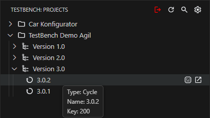
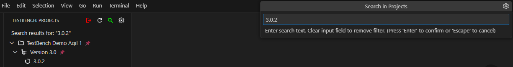
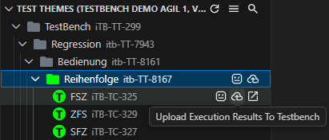

# TestBench Extension for Visual Studio Code

[](https://marketplace.visualstudio.com/items?itemName=imbus.testbench-extension)
[](https://marketplace.visualstudio.com/items?itemName=imbus.testbench-extension)
[](https://marketplace.visualstudio.com/items?itemName=imbus.testbench-extension)
[](LICENSE)

The **TestBench Extension** bridges [TestBench](https://www.testbench.com/) and [Robot Framework](https://github.com/robotframework/robotframework) directly inside VS Code. Navigate TestBench projects, synchronize keywords, generate test suites, execute tests, and upload results, all within your editor.

## Table of Contents

- [Quick Start](#quick-start)
- [Features](#features)
- [Requirements](#requirements)
- [Getting Started](#getting-started)
- [Extension Settings](#extension-settings)
- [Troubleshooting](#troubleshooting)
- [Release Notes](#release-notes)
- [License](#license)
- [Contributing](#contributing)

## Quick Start

1. Open the TestBench view and sign in with your TestBench connection
2. Set a Test Object Version (TOV) as active from the Projects view
3. Generate Robot Framework test suites from the Test Themes view
4. Execute tests (for example with RobotCode) and upload `output.xml` results back to TestBench

For full walkthroughs and advanced configuration, see the [User Guide](user-guide.md).

## Features

### Project Navigation

Browse your TestBench projects, Test Object Versions (TOVs), Test Cycles, Subdivisions, and Keywords in a dedicated sidebar. Tree view state (including expansion and visible views) is preserved across sessions.



### Test Suite Generation

Generate ready-to-run Robot Framework `.robot` test suites directly from TestBench test cases inside Test Themes View. Generated items are visually marked in the tree, and a single click on generated **Test Case Sets** opens the corresponding `.robot` file in the editor.


### Keyword Synchronization

Bidirectionally synchronize Robot Framework keywords between VS Code and TestBench using inline CodeLens actions. Push local changes to TestBench or pull the latest definition from the server, one keyword at a time or all at once.


### Resource File Management

Create and manage Robot Framework `.resource` files directly from TestBench subdivisions. Navigate from any keyword entry in Test Elements view directly to its definition in the resource file.


### Result Upload

After executing the generated test suites, upload results back to TestBench in one click. The extension reads the Robot Framework `output.xml` file and imports the verdicts directly to the server.

> **Note:** Result upload is available for generated items in a **Test Cycle** context.


### Search and Filtering

Filter tree items in real-time across the Projects, Test Themes, and Test Elements views. Configure search by name and tooltip in all views, and by UID in Test Themes/Test Elements, with options for case-sensitive and exact matching.



## Requirements

- **Visual Studio Code** 1.101.0 or higher
- **Python** 3.10 or higher
- **TestBench** 4.0 or higher
- **An open VS Code workspace or folder** (without one, the extension runs in read-only mode)

The following extensions are required and will be **installed automatically**:

| Extension                                                                                                | Purpose                        |
| -------------------------------------------------------------------------------------------------------- | ------------------------------ |
| [Python](https://marketplace.visualstudio.com/items?itemName=ms-python.python) (`ms-python.python`)      | Python runtime support         |
| [RobotCode](https://marketplace.visualstudio.com/items?itemName=d-biehl.robotcode) (`d-biehl.robotcode`) | Robot Framework test execution |

## Getting Started

### 1. Log In to TestBench

1. Open the TestBench view from the VS Code activity bar
2. Create or select a TestBench connection and click the login button
3. The Projects view opens automatically after a successful login


### 2. Link a Test Object Version to Your Workspace

Right-click a Test Object Version (TOV) in the Projects view and select **Set as Active TOV**. This links the TOV to your current workspace and enables TOV-context features.


### 3. Create a Robot Framework Resource File

In the **Test Elements** view, find a subdivision ending with `[Robot-Resource]` and click **Create Resource**. The resulting `.resource` file is automatically linked to the TestBench subdivision.

> **Tip:** The resource marker suffix (`[Robot-Resource]`) can be changed in the extension settings under **Resource Marker**.


### 4. Synchronize Keywords

Open a `.resource` file. CodeLens actions appear above each keyword definition to **push** (local -> TestBench) or **pull** (TestBench -> local). The file-level CodeLens syncs all keywords at once.

For synchronization to work, the resource file must contain a `tb:uid` (subdivision UID) and a `tb:context` (project/TOV) metadata line at the top. A minimal example looks like this:

```robot
tb:uid:<Subdivision-UID>
tb:context:<Project-Name>/<Test Object Version Name>

*** Keywords ***
My Keyword
    [Tags]    tb:uid:<Keyword-UID>
    [Arguments]    ${arg}
    # Implementation here
```

> **Note:** When creating a resource file via the extension, the metadata is added automatically.


If a keyword has no `tb:uid` tag, the CodeLens action will instead offer to **create** a new keyword in TestBench with the specified name and interface.

### 5. Generate and Execute Tests

Click the **Generate Robot Framework Test Suites** button next to any item in the **Test Themes** view to generate `.robot` test files for that item and its subtree. [RobotCode](https://marketplace.visualstudio.com/items?itemName=d-biehl.robotcode) extension can be used to execute the generated tests.


### 6. Upload Results

After test execution, click the **Upload Execution Results To TestBench** button next to any generated item in the Test Themes view to import results from `output.xml` back to TestBench.

> **Note:** Result import requires test suites to have been generated from a **Test Cycle** (not a TOV directly).



## Extension Settings

Settings are available via the gear icon on the login page or in the Projects view toolbar, or through **File → Preferences → Settings → Extensions → TestBench**.

The table below lists the most-used settings for day-to-day workflows.

| Setting                                  | Default                | Description                                                                                       |
| ---------------------------------------- | ---------------------- | ------------------------------------------------------------------------------------------------- |
| `automaticLoginAfterExtensionActivation` | `false`                | Automatically log in using the last used connection on startup                                    |
| `outputDirectory`                        | `tests`                | Output directory for generated `.robot` test files (relative to workspace root)                   |
| `outputXmlFilePath`                      | `results/output.xml`   | Path to the Robot Framework results file used when importing results (relative to workspace root) |
| `resourceDirectoryPath`                  | _(empty)_              | Local directory for `.resource` files (relative to workspace root)                                |
| `resourceMarker`                         | `["[Robot-Resource]"]` | Suffix that identifies TestBench subdivisions as Robot Framework resources                        |
| `cleanFilesBeforeTestGeneration`         | `true`                 | Delete existing files in the output directory before generating new test suites                   |
| `openTestingViewAfterTestGeneration`     | `false`                | Automatically open the VS Code Testing view after test generation                                 |
| `testbenchLogLevel`                      | `Info`                 | Log verbosity: `No logging`, `Trace`, `Debug`, `Info`, `Warn`, `Error`                            |
| `certificatePath`                        | _(empty)_              | Path to a custom or self-signed `.pem` certificate for the TestBench server                       |

All path settings are relative to the workspace root. `certificatePath` accepts both absolute and relative paths. Alternatively, you can set the `NODE_EXTRA_CA_CERTS` environment variable to point to your certificate file instead of using the `certificatePath` setting.

For the full settings reference, see the [User Guide](user-guide.md#extension-settings).

## Troubleshooting

**Extension is running in read-only mode**

Open a workspace or folder in VS Code. Features such as test generation and result import require an open workspace.

**Cannot generate tests or import results**

- Confirm `outputDirectory` and `outputXmlFilePath` settings are correct (paths are relative to the workspace root)
- Ensure the RobotCode extension is installed and enabled
- Verify that test suites have been executed and the `output.xml` file exists
- Check that the tree items are not locked in the TestBench client

**Connection issues with a custom certificate**

Set the `certificatePath` setting to your `.pem` certificate file, or set the `NODE_EXTRA_CA_CERTS` environment variable before starting VS Code.

**General reset**

Use **Reload Window** (`Ctrl+R` / `Cmd+R`) to resolve transient issues. For persistent problems, run the **TestBench: Clear All Extension Data** command to reset all stored extension data.

> **Warning:** Clear All Extension Data cannot be undone and will remove all stored connections.


## Release Notes

See [CHANGELOG.md](CHANGELOG.md) for the full list of changes.

## License

This project is licensed under the Apache-2.0 License. See the [LICENSE](LICENSE) file for details.

## Contributing

Found a bug or have a feature request? Open an issue on our [GitHub repository](https://github.com/imbus/testbench-vscode-extension).

Before submitting a pull request, please review the [contribution guidelines](CONTRIBUTING.md).
