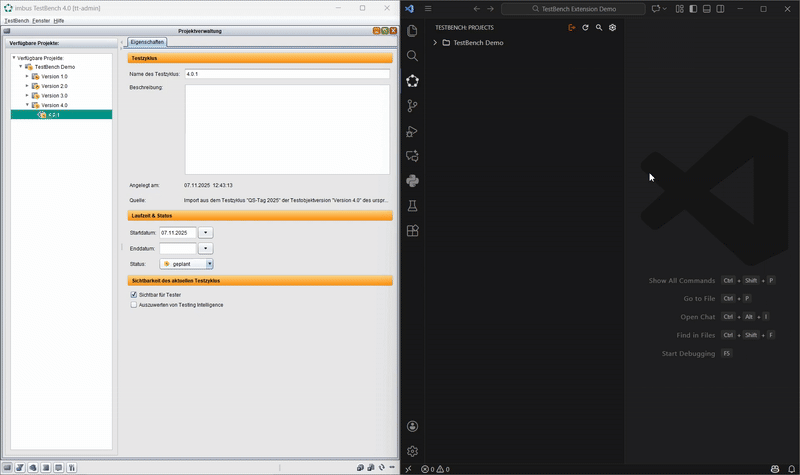
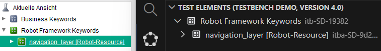
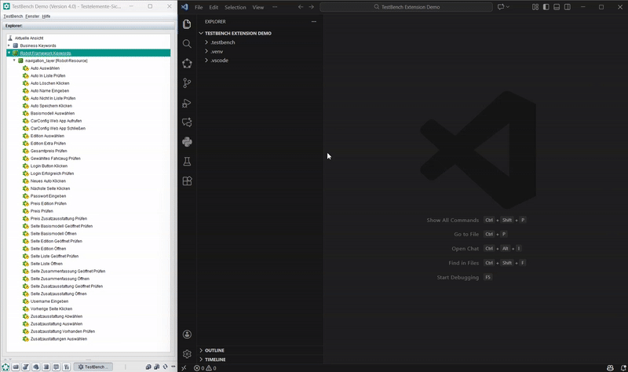
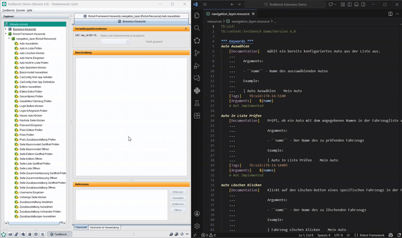
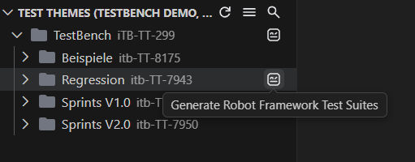
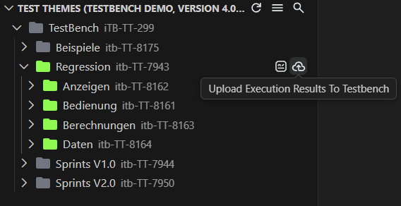

# TestBench Extension for Visual Studio Code

The **TestBench Extension** enables seamless synchronization between [TestBench](https://www.testbench.com/) and [Robot Framework](https://github.com/robotframework/robotframework) files in VS Code. Manage projects, synchronize keywords, generate test suites, execute tests, and import results—all from your IDE.

## Key Features

- **Project Navigation**: Browse TestBench projects, including Subdivisions, keywords, and Test Theme Trees
- **Keyword Synchronization**: Bidirectionally synchronize Robot Framework keywords with keywords in TestBench
- **Test Generation**: Automatically generate Robot Framework test suites from TestBench test case sets
- **Result Import**: Upload Robot Framework execution results directly back to TestBench

## Requirements

- **Visual Studio Code** version 1.101.0 or higher
- **Python** 3.10 or higher
- **TestBench** 4.0 or higher

### Required Extensions

The following extensions are automatically installed as dependencies when you install the TestBench extension:

- **Python extension** (`ms-python.python`) - Required for Python support
- **RobotCode extension** (`d-biehl.robotcode`) - Required for Robot Framework test execution

## Quick Start

### Login to TestBench

1. Open the TestBench view in VS Code (activity bar icon)
2. Create or select a TestBench connection and press the login button
3. After the first login, the Projects view opens automatically


### Link a TestBench Project to the Workspace/Folder Opened in VS Code

A workspace or folder in VS Code must always be linked to a specific Test Object Version in TestBench. Only after creating such a link you will be able to use all features of the extension, including the synchronization of Robot Framework keywords.
To link a TestBench Project to the opened workspace/folder, simply right-click on the desired Test Object Version in the Projects view and select "Set as Active TOV".



### Create a Robot Framework Resource File from a TestBench Subdivision

For a TestBench Subdivision to be visible in the TestBench extension, the Subdivision name must end with the suffix `[Robot-Resource]`. Subdivisions that do not follow this naming convention are ignored by the extension.



To create a Robot Framework resource file from a TestBench Subdivision, simply hover over the corresponding Subdivision in the `Test Elements` view and click the `Create Resource` button. Afterwards, you can use the test elements view of the extension to navigate between keywords and resource files.
The path where the resource file is created can be configured in the extension settings.



### Synchronize Robot Framework Keywords with TestBench

To synchronize Robot Framework keywords between VS Code and TestBench, open the Robot Framework resource file that contains the keywords you want to synchronize. You will see CodeLens actions above each keyword definition that allow you to either push the keyword to TestBench or pull the keyword from TestBench.

A precondition for the synchronization is that the resource file contains information about which TestBench Subdivision, Project, and TOV it is linked to. When creating the resource file via the extension, this information is automatically added to the file. If not, you need to manually add the following information to the resource file:

```
tb:uid:<Subdivision-UID>
tb:context:<Project-Name>/<Test Object Version Name>

*** Keywords ***
My Keyword
    [Tags]    tb:uid:<Keyword-UID>
    ⋮
```

An example of a Robot Framework resource file with the required TestBench metadata comments is shown below:

```robot
tb:uid:itba-SD-9d23166fb5
tb:context:TestBench Demo/Version 4.0

*** Keywords ***
Auto Auswählen
    [Tags]    tb:uid:iTB-IA-5100
    [Arguments]    ${name}
    # Not Implemented
```

As shown in the example above, each keyword that is synchronized with TestBench must have a tag with the format `tb:uid:<Keyword-UID>` where `<Keyword-UID>` is the UID of the corresponding TestBench keyword.

With the required metadata in place, you can now use the CodeLens actions to push or pull keywords between VS Code and TestBench. You can also use the code lens at the top of the file to push or pull all keywords in the file at once.



If there is no uid tag in a keyword, the CodeLens action will allow you to **create** a new keyword in TestBench with the specified name and interface.

### Generate Robot Framework Tests from TestBench Testcases

After using the Robot Framework keywords within TestBench Testcases to specify the test logic, you can generate Robot Framework test suites from the Testcases defined in TestBench.
The generated Robot Framework test suites will be created in your workspace/folder and can afterwards be executed or debugged. To generate Robot Framework tests, simply hover over the desired Testcase in the `Test Themes` view and click the `Generate Robot Framework Test Suites` button. The path where the test suites are created and the format of the tests can be configured in the extension settings. Please note that depending on which test cycle or test object version is opened in the extension, different testcases will be generated.



### Upload Execution Results Back to TestBench

After executing the generated Robot Framework test suites, you can import the execution results back to TestBench. To do so, simply hover over the desired Testcase in the `Test Themes` view and click the `Upload Execution Results To TestBench` button. The extension will then look for the corresponding Robot Framework output files in the configured output directory and import the results back to TestBench. Please note that execution results can only be imported if the test suites have been generated from a Test Cycle in TestBench (not a Test Object Version).



## Certificate Path

To make the VS Code extension trust a custom or self-signed certificate from your TestBench server, you can set the Certificate Path in the extension settings.

### How to set it:

- Obtain the public certificate file (.pem) from your TestBench server.
- In the extension settings, set Certificate Path.

<!-- ## Documentation

For comprehensive documentation including detailed feature descriptions, configuration settings, and a troubleshooting guide, see the [User Guide](user-guide.md). -->

## License

This project is licensed under the Apache-2.0 License. See the [LICENSE] file for details.

## Contributing / Feedback

If you encounter any issues or have suggestions for improvements, please open an issue on our [GitHub repository](https://github.com/imbus/testbench-vs-code-extension).
Please check out our [contribution guidelines](CONTRIBUTING.md) for details on how to report issues or suggest enhancements before submitting a pull request.
