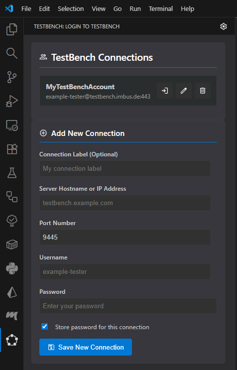

## Requirements

- Visual Studio Code 1.101.0 or newer
- Python 3.10 or newer
- TestBench 4.0 or newer
- Open VS Code workspace folder (required for write operations)

## Install the extension

1. Install the [TestBench extension from the Visual Studio Marketplace](https://marketplace.visualstudio.com/items?itemName=imbus.testbench-extension). You can also find it in the Extensions view by searching for the extension identifier `imbus.testbench-extension`.
2. Verify that the extension is enabled in VS Code.
3. If prompted, reload VS Code to complete activation.

## Automatically installed dependencies

The extension installs these VS Code dependencies automatically:

- Python extension (`ms-python.python`)
- RobotCode extension (`d-biehl.robotcode`)

## Next steps

After installation, continue with [Quickstart](quickstart.md) to open the TestBench view, create or select a connection, and run your first workflow.
