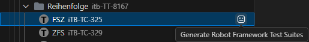
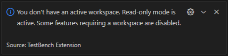

import loginWebm from './videos/login.webm';
import loginMp4 from './videos/login.mp4';
import linkTovWebm from './videos/link_tov.webm';
import linkTovMp4 from './videos/link_tov.mp4';

## 1. Open workspace and sign in

1. Open a workspace folder in VS Code.
2. Open the TestBench view from the side bar.
3. Create or select a connection and sign in. To create a new connection, use the connection form in the TestBench view, enter server, port, username, and password, then sign in.

<video controls preload="metadata" playsinline width="100%">
    <source src={loginWebm} type="video/webm" />
    <source src={loginMp4} type="video/mp4" />
    Your browser does not support the video tag.
</video>

## 2. Set active context from Projects View

1. In Projects View, navigate to a project.
2. Right-click the target test object version (TOV) you want to work with and choose **Set as Active TOV**.

<video controls preload="metadata" playsinline width="100%">
    <source src={linkTovWebm} type="video/webm" />
    <source src={linkTovMp4} type="video/mp4" />
    Your browser does not support the video tag.
</video>

The extension stores this TOV context in `.testbench/ls.config.json`.

## 3. Open the context you want to work with

Open either the test object version you selected as active context, or a cycle that belongs to this test object version.

The available features depend on what you open from Projects View:

- If you open a TOV context, test generation is available.
- If you open a cycle context, test generation and execution results upload are available.

## 4. Generate tests and run them

You can start test generation from either of these two views:

1. Projects View:
    - Run **Generate Robot Framework Test Suites (Cycle based)** on a cycle to generate suites for that cycle scope.
    - Run **Generate Robot Framework Test Suites (TOV based)** on a TOV when you want TOV-scope generation.
2. Test Themes View:
    - Run **Generate Robot Framework Test Suites** on a test theme or test case set node to generate that subtree.
3. Execute the generated tests (for example with RobotCode).

## 5. Upload execution results

1. Ensure the Robot Framework execution tool you used produced the file `output.xml`.
2. Ensure that the extension setting `testbenchExtension.outputXmlFilePath` points to that `output.xml`.
3. In Test Themes view, use the **Upload Execution Results To TestBench** button on a generated node. You can upload a single generated node or a generated subtree.
4. Verify that uploaded items are updated in TestBench.

## Workspace behavior

- When a workspace is open, the full feature set is available.
- When no workspace is open, the extension is in read-only mode. Test generation, execution results upload, resource creation, and keyword synchronization actions that modify local files or TestBench content are unavailable.

## Context behavior

- In a cycle-based context, test generation and execution results upload are available.
- In a TOV-only context, test generation is available, but execution results upload is unavailable.
