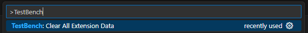

| Symptom                                                                    | Likely Cause                                 | Resolution                                                                                                                                  |
| -------------------------------------------------------------------------- | -------------------------------------------- | ------------------------------------------------------------------------------------------------------------------------------------------- |
| Extension in read-only mode                                                | No folder/workspace opened                   | Open a workspace folder in VS Code.                                                                                                         |
| **Upload Execution Results To TestBench** button is missing in Test Themes | Test Themes opened from TOV instead of cycle | Open a cycle from Projects View; upload is cycle-context only.                                                                              |
| Uploading execution results fails                                          | `output.xml` missing or wrong path           | Verify **outputXmlFilePath** and test runner output location.                                                                               |
| No CodeLens actions available for a resource file                          | Invalid or missing resource metadata/context | Ensure the correct TOV context is selected in Projects View and verify that `tb:uid` and `tb:context` exist and match the selected context. |
| TLS/certificate errors                                                     | Untrusted server certificate                 | Configure **certificatePath** or **NODE_EXTRA_CA_CERTS**.                                                                                   |
| Unexpected redirect to login view                                          | Session could not be recovered automatically | Check network/server availability, then sign in again. If this persists, verify proxy/certificate settings and server reachability.         |

## Session keep-alive and automatic recovery

- While you are logged in, the extension sends a keep-alive request (`GET /2/login/session`) every 30 seconds to prevent session timeout.
- Temporary request failures are retried automatically (typically up to 3 retries with a short delay between attempts).
- If keep-alive returns HTTP `401` (Unauthorized), the extension first attempts silent re-authentication.
- If retries and re-authentication do not recover the session, or if API requests continue to fail with session-expired/forbidden or network-unreachable conditions, the extension performs a local logout and returns to the login view.

## Reset and recovery actions

### Reload Window

Use **Reload Window** when the extension UI appears out of sync, for example after connection changes, missing/disabled view actions, or stale tree content.

To run it:

1. Open the Command Palette (**Ctrl+Shift+P** / **Cmd+Shift+P**).
2. Run **Developer: Reload Window**.

### TestBench: Clear All Extension Data

Use **TestBench: Clear All Extension Data** when problems persist after a reload and you want to reset extension state.

You can trigger it from the Command Palette:

1. Open the Command Palette (**Ctrl+Shift+P** / **Cmd+Shift+P**).
2. Run **TestBench: Clear All Extension Data**.

:::warning
**Clear All Extension Data** removes persisted extension data, including stored connections. This operation cannot be undone.
:::

## Need more help?

For bug reports or feature requests, use the
[TestBench VS Code extension GitHub repository](https://github.com/imbus/testbench-vscode-extension).
