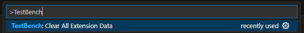

| Symptom                                                                    | Likely Cause                                                      | Resolution                                                                                                                                                |
| -------------------------------------------------------------------------- | ----------------------------------------------------------------- | --------------------------------------------------------------------------------------------------------------------------------------------------------- |
| Extension in read-only mode                                                | No folder/workspace opened                                        | Open a workspace folder in VS Code.                                                                                                                       |
| **Upload Execution Results To TestBench** button is missing in Test Themes | Test Themes opened from TOV instead of cycle                      | Open a cycle from Projects View; upload is cycle-context only.                                                                                            |
| Test generation or upload skipped some selected items                      | One or more Test Theme tree items are locked by another user      | Locked items are skipped by design. Check lock status/owner in TestBench, unlock (or wait until unlocked), then run the operation again.                  |
| Uploading execution results fails                                          | `output.xml` missing or wrong path                                | Verify **outputXmlFilePath** and test runner output location.                                                                                             |
| No CodeLens actions available for a resource file                          | Invalid or missing resource metadata/context                      | Ensure the correct TOV context is selected in Projects View and verify that `tb:uid` and `tb:context` exist and match the selected context.               |
| TLS/certificate errors                                                     | Untrusted server certificate                                      | Configure **certificatePath** or **NODE_EXTRA_CA_CERTS**.                                                                                                 |
| Unexpected redirect to login view                                          | Session could not be recovered automatically                      | Check network/server availability, then sign in again. If this persists, verify proxy/certificate settings and server reachability.                       |
| Login is refused with **Incompatible TestBench server version**            | TestBench server is older than the version the extension supports | Install the extension version named in the dialog, or update the TestBench server. See [TestBench server version check](#testbench-server-version-check). |
| Warning that the TestBench server is newer than the supported version      | Extension is older than the connected TestBench server            | You can keep working. Check for an extension update from the warning. See [TestBench server version check](#testbench-server-version-check).              |

## Session keep-alive and automatic recovery

- While you are logged in, the extension sends a keep-alive request (`GET /2/login/session`) every 30 seconds to prevent session timeout.
- Temporary request failures are retried automatically (typically up to 3 retries with a short delay between attempts).
- If keep-alive returns HTTP `401` (Unauthorized), the extension first attempts silent re-authentication.
- If retries and re-authentication do not recover the session, or if API requests continue to fail with session-expired/forbidden or network-unreachable conditions, the extension performs a local logout and returns to the login view.

## TestBench server version check

On every login the extension reads the version of the TestBench server and compares its major and
minor version with the TestBench version the installed extension was built against. The patch
version is ignored, so extension support for TestBench `4.1` also covers server version `4.1.03`.

The check exists because the extension updates itself automatically while a TestBench installation
does not. Without it, an auto-updated extension could silently talk to a server it does not support.

There are four outcomes:

| Server version                            | Behavior                                                                |
| ----------------------------------------- | ----------------------------------------------------------------------- |
| Same major and minor version as supported | Login continues, nothing is shown.                                      |
| **Older** than the supported version      | Login is refused with a dialog; this combination is known not to work.  |
| **Newer** than the supported version      | Login continues; a warning is shown once.                               |
| Cannot be determined or read              | Login is refused; check the connection details and server reachability. |

### Older than the supported version

This combination is known not to work, so the extension refuses the connection and returns to the
login view. The dialog names the TestBench version the extension expects and, where one exists, the
last extension version that supported your server version. Either install that extension version or
update the TestBench server.

### Newer than the supported version

A server newer than the supported version is not known to be incompatible — the extension simply
has no information about it, because the next breaking change to the TestBench API is unknown at the
time an extension version is built. The extension therefore only warns and lets you continue
working; you decide whether to look for an extension update.

The warning names the installed extension version, the detected TestBench version and the TestBench
version the extension supports, and it appears once per server version per VS Code window rather
than on every subsequent action.

Its **Check for Extension Updates** action runs VS Code's own check for extension updates and opens
the extension page. The extension does not query the Marketplace itself: at the moment the warning
appears, an extension version supporting your TestBench version usually does not exist yet.

If you see this warning, you are typically running with extension auto-update switched off. Enable
**Extensions: Auto Update** in VS Code to receive a supporting extension version as soon as it is
published.

## Reset and recovery actions

### Reload Window

Use **Reload Window** when the extension UI appears out of sync, for example after connection changes, missing/disabled view actions, or stale tree content.

To run it:

1. Open the Command Palette (**Ctrl+Shift+P** / **Cmd+Shift+P**).
2. Run **Developer: Reload Window**.

### TestBench: Clear All Extension Data

Use **TestBench: Clear All Extension Data** when problems persist after a reload and you want to reset extension state.

You can trigger it from the Command Palette:

1. Open the Command Palette (**Ctrl+Shift+P** / **Cmd+Shift+P**).
2. Run **TestBench: Clear All Extension Data**.

:::warning
**Clear All Extension Data** removes persisted extension data, including stored connections. This operation cannot be undone.
:::

## Need more help?

For bug reports or feature requests, use the
[TestBench VS Code extension GitHub repository](https://github.com/imbus/testbench-vscode-extension).
