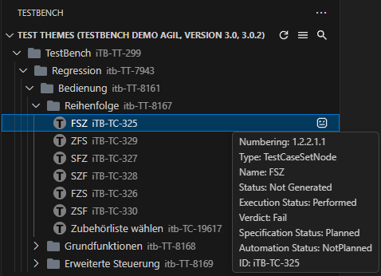
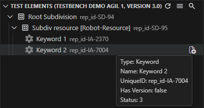

The extension is organized around three main views. In [Projects View](projects-view.md), you browse projects, TOVs, and cycles, define the active context, and start generation from project nodes. In [Test Themes View](test-themes-view.md), you generate Robot Framework suites, open generated files, and upload execution results. In [Test Elements View](test-elements-view.md), you work with subdivisions and resource files, navigate keywords, and synchronize keyword definitions.

## Shared behavior

Search is available in all three views and filters the currently displayed tree items in real time. You can search by name and tooltip in all views, and by UID in Test Themes and Test Elements, with optional case-sensitive and exact matching. The extension also preserves view state across sessions, including expansion state and which views are currently shown or hidden.

