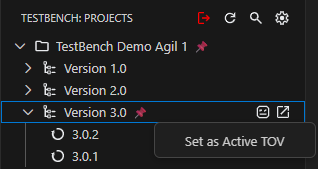

**Projects View** is the entry point for working with TestBench content in VS Code. It lets you browse projects, Test Object Versions (TOVs), and Test Cycles, and open the context used by the other views.

## Open context

Opening a **Test Object Version** loads the selected TOV into **Test Themes View** and **Test Elements View**. Opening a **Test Cycle** also loads its context into **Test Themes View** and **Test Elements View**.

## Set the active configuration

To define the working context, right-click a project and choose **Set as Active Project** when you only want to set the project. Right-click a TOV and choose **Set as Active TOV** when you want to set both the active TOV and its parent project in one step. The selected active project and active TOV are visually pinned as the first items in **Projects View**, and the active configuration is written to `.testbench/ls.config.json`.

## Generate tests from project nodes

Use **Generate Robot Framework Test Suites (TOV based)** to start generation for a selected TOV. Use **Generate Robot Framework Test Suites (Cycle based)** to start generation for a selected cycle.

## Toolbar buttons

The Projects View toolbar provides quick actions for the current session and tree content:

- **Refresh Projects** reloads tree content from TestBench.
- **Search** filters projects, TOVs, and cycles in the tree.
- **Logout** signs you out locally in the extension and returns to the login view. It does not terminate the server-side session for other API clients that use the same account.
- **Open Extension Settings** opens TestBench extension settings. For details on all settings, see [Settings Reference](../configuration/settings-reference.md).

## Persisted state

Tree expansion and collapse state is preserved across sessions, the shown/hidden view state is remembered, and the last active project context is restored.
