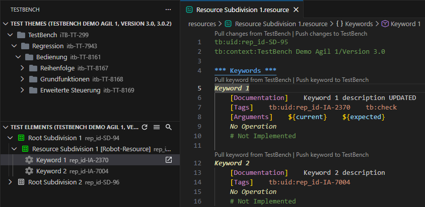

**Test Elements View** shows the resource subdivisions and keywords for the currently opened TestBench context.

## Resource identification and action visibility

Subdivisions with a configured resource marker suffix are treated as Robot Framework resources.

The default resource marker suffix is `[Robot-Resource]` and can be changed with the **resourceMarker** extension setting.

The **Create Resource** and **Open Resource** actions are shown only for subdivisions that match the configured resource marker suffix. **Open in Explorer View** is shown for subdivision folder nodes.

## Create or open resource files

Use **Create Resource** to create a `.resource` file for a resource subdivision. Use **Open Resource** to open an existing `.resource` file for that subdivision. Use **Open in Explorer View** to reveal the related subdivision folder in the VS Code Explorer view.

## Required metadata for synchronization

When the extension creates a resource file, it writes metadata comments at the top:

```robot
tb:uid:<Subdivision-UID>
tb:context:<Project-Name>/<Test Object Version Name>
```

These metadata lines are required for synchronization and must be kept valid. If metadata is missing or invalid, the extension offers **Quick Fix** actions to restore them.

## Keyword navigation

Single-clicking a keyword opens the corresponding resource file and jumps to the keyword definition. Double-clicking performs the same action and also reveals the resource file in the VS Code Explorer view.

## Keyword synchronization

CodeLens actions are inline clickable commands shown directly in the editor above a resource file or keyword definition. They support pulling keyword definitions from TestBench, pushing local keyword definitions to TestBench, and synchronizing either a single keyword or the entire resource file.



## Toolbar buttons

The Test Elements View toolbar provides quick actions for navigation and tree updates:

- **Open Projects View** switches back to Projects View.
- **Refresh Test Elements** reloads the current Test Elements context.
- **Search** filters subdivisions and keywords in the tree.
