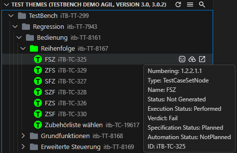
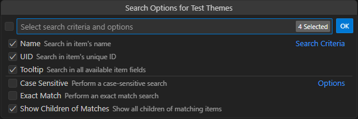

**Test Themes View** is used to generate Robot Framework suites from TestBench structures and to upload execution results back to TestBench.

## Open context

Open a TOV or cycle from **Projects View** to load the corresponding **Test Themes View**. For a complete workflow that includes execution results upload, open a cycle context.

## Generate Robot Framework test suites

Every Test Theme and Test Case Set node has a **Generate Robot Framework Test Suites** action. Running it generates suites for the selected node and its subtree. Generated items are visually marked in the tree.
Test generation uses the bundled `testbench2robotframework` library. The output location is controlled by the **outputDirectory** extension setting. Optional pre-generation cleanup is controlled by **cleanFilesBeforeTestGeneration**, which deletes existing files in the output directory before new suites are generated.

## Open generated files

Single-clicking a generated test case set opens its `.robot` file. Double-clicking opens the file and also reveals it in the VS Code Explorer view.

## Execute and upload results

Run generated suites with RobotCode or any other Robot Framework runner before uploading results.

Use the tree item action **Upload Execution Results To TestBench** on the node you want to upload. You can upload a selected subtree or a single node.
The **Upload Execution Results To TestBench** action is visible for generated nodes and generated subtree contexts. Upload reads Robot Framework test execution results from `output.xml`, and the default result path is defined by **outputXmlFilePath** relative to the workspace. After a successful upload, affected tree items are updated to `Performed` and show verdict details in their tooltips. The upload action is available only when **Test Themes View** is opened from a cycle context.

## Toolbar buttons

The Test Themes View toolbar provides quick actions for navigation and tree updates:

- **Open Projects View** switches back to Projects View.
- **Refresh Test Themes** reloads the current Test Themes context.
- **Search** filters test themes and test case sets in the tree.

