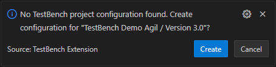
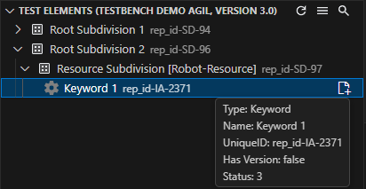
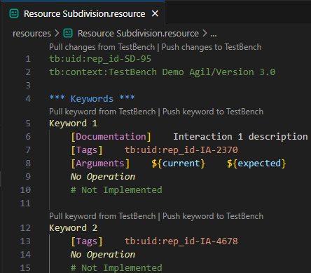
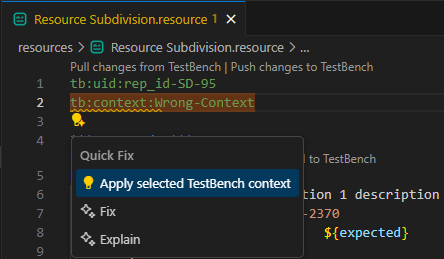

This guide explains how to use the TestBench VS Code Extension to navigate inside projects, generate Robot Framework tests, execute them, import results back to TestBench and manage Robot Framework resource files.

## Requirements

- Python 3.10 or newer installed on your system
- An open VS Code workspace. Without a workspace, the extension runs in read-only mode and features like test generation and importing results are disabled

**Note:** The following VS Code extensions are required dependencies and will be automatically installed (if not already present) when you install the TestBench extension:

- Python extension (`ms-python.python`)
- RobotCode extension (`d-biehl.robotcode`) - for Robot Framework test execution

## Quick Start

1. Open the TestBench view in VS Code (activity bar icon)
2. Create/select a TestBench connection and log in
3. After the first login, the Projects view opens automatically

If no workspace is open, the extension informs you that it's running in read-only mode.


## Login and Connections


- **Managing connections:** You can create, edit, or delete TestBench connections. Each connection includes a **label** (optional display name), **server URL**, **port**, **username**, and **password**, so you can easily switch between different servers or user accounts.
- **Secure storage:** The extension stores your connection details in **VS Code Secret Storage**, which is encrypted and managed by VS Code. Saving the **password** is optional. If you prefer, you can leave it unsaved and enter it manually each time you log in.
- **Unique connections:** Each connection label must be unique. The extension prevents creating duplicate connections with the same host, port, and username combination
- **Settings access:** Click the Extension Settings button at the top-right of the login page to open extension settings

## Projects View

- Projects view is opened by default when you log in to a TestBench account for the first time
- Displays all available projects for the logged-in user. A project can contain Test Object Versions (TOVs), and TOVs can contain Test Cycles
- **Toolbar buttons:** Logout, Refresh Projects, Search, Open Extension Settings
- **Action buttons:** Each Test Object Version and Test Cycle tree item has two action buttons: one button to open it in the Test Themes view, and another button to generate Robot Framework tests for that item including its contained hierarchy.
- **Read-only mode:** In read-only mode, TOVs and Cycles do not have test generation buttons
- **Opening a TOV or Cycle:** Click the open button next to a TOV or Cycle to open it. Alternatively, you can double-click directly on a Cycle's name as a shortcut to open it
- **View switching:** Opening a TOV or Cycle in Projects view switches to a new view where the Test Themes view and Test Elements view are displayed together for that selected context
- **State persistence:** The extension remembers visible tree views and expansion/collapse states of tree items, restoring them when you log in again so that you can continue where you left off


### Context Configuration

You can mark one Project and one TOV as **active**. The active Project/TOV pair defines the context used by other views (Test Themes and Test Elements), and this context configuration is stored in a config file at `.testbench/ls.config.json` in your workspace root.

- If `.testbench/ls.config.json` doesn't exist, the extension offers to create it and automatically fills in the `projectName` and `tovName` when you open a TOV or Cycle



- **Manual activation:** Right-click a Project or TOV and select 'Set as Active Project' or 'Set as Active TOV'. A pin icon marks the active items in the Projects tree view
- **Live updates:** The extension monitors `ls.config.json` for changes and automatically updates pin icons in the Projects view


- **Configuration validation:** If `ls.config.json` is missing or invalid, the extension offers a guided fix to set a valid configuration based on your visible projects and TOVs

Example `ls.config.json`

```json
{
    "projectName": "MyProject",
    "tovName": "MyTOV"
}
```

## Search in Tree Views

- **Activating search:** Click the Search button in any tree view to start filtering tree items
- **Live filtering:** Tree items are filtered in real-time as you type in the search box
- **Search indicator:** The search icon changes color when a search is active. Clearing the search text disables the search and restores all tree items


- **Search options:** Click the gear icon on top-right of the search UI to configure search behavior:
    - **Search criteria:** Choose to search by Name, Tooltip, or UIDs (note: Projects view items do not have UIDs)
    - **Match options:**
        - Case Sensitive: Match exact letter casing
        - Exact Match: Require complete word/phrase match
        - Show Children of Matches: Also display all children of matching items


## Test Themes View


- The Test Themes view is opened by opening a TOV or Cycle in the Projects view
- It displays test themes and test case sets for the opened TOV or Cycle
- The view title includes the Project, TOV, and Cycle name to show the current context
- **Toolbar buttons:** Refresh Test Themes, Open Projects View, Search
- **Visibility rules:** The view hides tree items that meet any of these conditions:
    - Test Cases (individual test cases are hidden; only test case sets are shown)
    - Items with execution status `NotPlanned`
    - Items locked by the system

## Generating Robot Framework Tests

- **Generating tests:** Click the Robot Framework icon next to any tree item in Test Themes view to generate tests for that item or its entire subtree. Test generation process uses the bundled `testbench2robotframework` library internally


- **Output location:** Configure the output directory via the 'Output Directory' setting (path is relative to the workspace root)

- **Visual marking:** After test generation, generated tree items are marked visually in the tree. The extension watches generated files and folders for changes, automatically updating tree item markings when files are removed, moved, or added


- **Opening generated tests:**
    - **Single-click** a Test Case Set: Opens the generated `.robot` file in the editor
    - **Double-click** a Test Case Set: Opens the `.robot` file and reveals its location in VS Code Explorer

<!-- TODO: Add a GIF showing single-click to open .robot file / double-click to open and reveal in Explorer -->

- **Auto-open Testing view:** Enable 'Open Testing View After Test Generation' in Extension settings to automatically open VS Code's Testing view after generating tests to be able to run them immediately

## Execute and Import Results

- **Executing tests:** Generated tests can be executed using the RobotCode extension
- **Result files:** Robot Framework writes test execution results to an `output.xml` file. Configure the 'Output Xml File Path' setting (relative to the workspace root) to point to this file
- **Import buttons:** After test generation, an Import button appears next to generated tree items, allowing you to:
    - Import results for an entire generated hierarchy from the top-most item, or
    - Import results for specific items only
- **Result updates:** After importing results:
    - Tree item tooltips are updated to display execution results
    - Execution status of imported items is set to `Performed`
    - The verdict field shows the execution outcome

<!-- TODO: Add a GIF showing Import button appearing after test generation, clicking it and import progress -->

## Test Elements View



- The Test Elements view displays subdivisions and their keywords for the current TOV context
- The view title includes the Project and TOV name to show the current context
- The 'Resource Marker' setting identifies subdivisions that correspond to Robot Framework resources. Subdivisions whose names end with this marker are treated as `.resource` files

- **Creating resources:** Use the 'Create Resource' button on a subdivision to create a local `.resource` file. After creation, the file is revealed in the VS Code Explorer and opened in the editor

- **Visual indicators:** Subdivision tree items that are locally available as resource files show differently colored icons to indicate their availability. The 'Create Resource' button changes to 'Open Resource' for existing resource files

<!-- TODO: Add a GIF clicking 'Create Resource' button, file creation, tree item color change, reveal in Explorer, and opening in editor -->

- **Keyword navigation:**
    - **Single-click:** Opens the corresponding resource file in the editor and jumps directly to the keyword definition
    - **Double-click:** Opens the resource file, jumps to the keyword definition, and reveals the file location in VS Code Explorer

.png>)

### Language Server Features for Resource Files

- **Metadata:** The first two lines of a generated resource file contain metadata: the subdivision UID and its context



- **Validation:** If context metadata is missing or invalid, a quick fix is available to set the correct context



- **Synchronization:** CodeLens actions displayed above metadata and keywords allow you to pull changes from and push changes to the TestBench server to keep local files synchronized with the TestBench server

## Extension Settings

Settings are grouped in VS Code under these sections

- Login
- Logger
- TestBench2RobotFramework
- Test Generation
- Connection

### Settings Overview

#### Login Settings

- **Automatic Login After Extension Activation**
    - **Type:** Boolean
    - **Default:** `false`
    - **Description:** When enabled, the extension automatically attempts to log in to the TestBench server using the last used connection after the extension is activated.

#### Logger Settings

- **TestBench Log Level**
    - **Type:** String (Enum)
    - **Default:** `Info`
    - **Options:** `No logging`, `Trace`, `Debug`, `Info`, `Warn`, `Error`
    - **Description:** Sets the minimum log level for the extension. Logs are saved in the log folder inside the `.testbench` directory within the workspace. Choose `Trace` or `Debug` for detailed troubleshooting, `Info` for general operation monitoring, `Warn` for warnings only, or `Error` to log only errors. Select `No logging` to disable logging entirely. Log rotation automatically manages log files (up to 3 files, max 10 MB each).

#### TestBench2RobotFramework Settings

These settings control how the extension generates Robot Framework test suites from TestBench data.

- **Use Configuration File**
    - **Type:** Boolean
    - **Default:** `false`
    - **Description:** When enabled, `testbench2robotframework` prioritizes settings specified in the `pyproject.toml` file over the extension settings defined in VS Code.

- **Clean Files Before Test Generation**
    - **Type:** Boolean
    - **Default:** `true`
    - **Description:** When enabled, deletes all files present in the output directory before new test suites are created.

- **Fully Qualified Keywords**
    - **Default:** `false`
    - **Description:** When enabled, Robot Framework keywords are called by their fully qualified name (e.g., `LibraryName.Keyword Name`) in the generated test suites.

- **Output Directory**
    - **Type:** String
    - **Default:** `tests`
    - **Description:** Specifies the directory where the generated Robot Framework test suites (`.robot` files) will be created. The path is relative to the workspace root. For example, if set to `tests`, files will be created in `<workspace>/tests/`.

- **Compound Keyword Logging**
    - **Type:** String (Enum)
    - **Default:** `GROUP`
    - **Options:** `GROUP`, `COMMENT`, `NONE`
    - **Description:** Controls how compound TestBench keywords (keywords that contain other keywords) are logged in the generated test suites:
        - `GROUP`: Compound keywords are wrapped in a collapsible group
        - `COMMENT`: Compound keywords are marked with comments
        - `NONE`: No special logging for compound keywords

- **Log Suite Numbering**
    - **Type:** Boolean
    - **Default:** `false`
    - **Description:** When enabled, test suite numbering is logged in the generated Robot Framework files. This can help with traceability and organization when dealing with large numbers of test suites.

- **Library Marker**
    - **Type:** Array of Strings
    - **Default:** `["[Robot-Library]"]`
    - **Description:** Marker(s) used to identify TestBench Subdivisions that correspond to Robot Framework libraries. Subdivisions whose names end with any of these markers will be treated as Robot Framework libraries during test generation. For example, a subdivision named `MySubdivision [Robot-Library]` would be recognized as a library.

- **Library Root**
    - **Type:** Array of Strings
    - **Default:** `["RF", "RF-Library"]`
    - **Description:** Identifies TestBench root subdivision(s) whose direct children correspond to Robot Framework libraries.

- **Resource Root Regex**
    - **Type:** String
    - **Default:** `resources`
    - **Description:** Regular expression that identifies where the resource directory begins in TestBench's subdivision hierarchy. Acts as a cut point, where everything before this marker is ignored, and everything after it is preserved in the local file structure under the Resource Directory Path. For example: with regex `resources` and TestBench path `Project/resources/Login/Keywords`, the local file becomes `<Resource Directory Path>/Login/Keywords.resource` (ignoring `Project/resources`).

- **Resource Directory Path**
    - **Type:** String
    - **Default:** `""` (empty)
    - **Description:** Specifies the local directory where Robot Framework resource files (`.resource` files) will be stored. The path is relative to the workspace root. This setting works with Resource Root Regex to map TestBench's subdivision hierarchy to your local file system. For example: if Resource Root Regex is `resources` and this is set to `robot_resources`, a TestBench path like `Project/resources/Utils/Keywords` becomes `robot_resources/Utils/Keywords.resource` locally.

- **Resource Marker**
    - **Type:** Array of Strings
    - **Default:** `["[Robot-Resource]"]`
    - **Description:** Marker(s) used to identify TestBench Subdivisions that correspond to Robot Framework resources. Subdivisions whose names end with any of these markers are treated as Robot Framework resources. In the Test Elements view, subdivisions with this marker are displayed and have special actions to create or open the corresponding `.resource` file.

- **Resource Root**
    - **Type:** Array of Strings
    - **Default:** `["RF-Resource"]`
    - **Description:** Identifies TestBench root subdivision(s) whose direct children correspond to Robot Framework resources.

- **Library Mapping**
    - **Type:** Array of Strings
    - **Default:** `[]` (empty)
    - **Description:** Optional custom mapping of TestBench Subdivisions to Robot Framework library imports. Each entry must be in the format: `<TestBench Subdivision Name>:<Robot Framework Library import>`.

- **Resource Mapping**
    - **Type:** Array of Strings
    - **Default:** `[]` (empty)
    - **Description:** Optional custom mapping of TestBench Subdivisions to Robot Framework resource imports. Each entry must be in the format: `<TestBench Subdivision Name>:<Robot Framework Resource import>`.

- **Output Xml File Path**
    - **Type:** String
    - **Default:** `results/output.xml`
    - **Description:** The relative file path where the Robot Framework output XML file (test execution results) is stored. This file is generated by Robot Framework after test execution and is used by the extension to import test results back to the TestBench server. The path is relative to the workspace root. If not set, the extension will prompt you to select an `output.xml` file location when importing results.

#### Test Generation Settings

- **Clear Internal TestBench Directory Before Test Generation**
    - **Type:** Boolean
    - **Default:** `false`
    - **Description:** When enabled, deletes all files (excluding log files and project config file) from the internal `.testbench` directory before generating tests.

- **Open Testing View After Generation**
    - **Type:** Boolean
    - **Default:** `false`
    - **Description:** When enabled, the VS Code Testing view is automatically opened after test generation completes, where you can run the newly generated tests.

#### Connection Settings

- **Certificate Path**
    - **Type:** String
    - **Default:** `""` (empty)
    - **Description:** Optional path to the public TestBench server certificate file (`.pem` format). This can be either an absolute path or a path relative to the workspace root.

        **When to use:** A certificate is only required when connecting to TestBench servers that use self-signed certificates or custom certificate authorities (e.g., development/test environments or unofficial server versions). In production environments with official TestBench servers using standard certificates, this setting can be left empty.

        **How certificate validation works:**
        1. If Certificate Path is set, the extension uses both your custom certificate AND the system's default certificate store for validation
        2. If Certificate Path is empty, the extension checks the `NODE_EXTRA_CA_CERTS` environment variable (see below)
        3. If neither is set, only the system's default certificate store is used

        **Using NODE_EXTRA_CA_CERTS environment variable:** Instead of configuring Certificate Path in the extension settings, you can set the `NODE_EXTRA_CA_CERTS` environment variable to point to your certificate file.

        To set `NODE_EXTRA_CA_CERTS`:
        - **Windows:** Set a system or user environment variable `NODE_EXTRA_CA_CERTS=C:\path\to\certificate.pem`, then restart VS Code
        - **Linux/macOS:** Add `export NODE_EXTRA_CA_CERTS=/path/to/certificate.pem` to your shell profile (e.g., `~/.bashrc`, `~/.zshrc`), then restart your terminal and VS Code

### Note

- **All path strings in the extension settings are relative to your current VS Code workspace root, except Certificate Path which accepts both absolute and relative paths.** For example, if your workspace is `C:\MyWorkspace` and you want to set 'Output Directory' to `C:\MyWorkspace\tests`, use `tests`. For Certificate Path, you can use either `C:\certs\server.pem` (absolute) or `certs\server.pem` (relative).

- **Most settings apply at the workspace level**, meaning they are specific to the current workspace. Some settings like login and logging apply at the resource level, which allows different configurations for different workspace folders in a multi-root workspace.

## Logging

- **Log location:** Extension logs are stored in the `.testbench` folder within your workspace
- **Log levels:** NO LOGGING, INFO (default), WARN, ERROR, DEBUG, TRACE
- **Log rotation:** Up to 3 log files are maintained. When a log file exceeds 10 MB, a new file is created and the oldest file is overwritten

## Technical Details

- **Automatic retries:** The extension automatically retries failed but recoverable HTTP requests
- **Server unavailability:** If retries repeatedly fail, the extension assumes the server is unavailable and returns you to the login page
- **Session sharing:** When you're logged in on one VS Code window and open a new window, the extension shares the existing user session and automatically logs you in. Logging out in any window logs out all windows using that connection. The extension does not remove the current user session from the server during logout, so that other API users are not affected by this action

## Troubleshooting

**General Requirements:**

- Ensure a folder is opened as your VS Code workspace
- Python 3.10 or newer must be installed and available to VS Code

**Cannot generate or import results:**

- Verify that 'Output Directory' and 'Output Xml File Path' settings are configured correctly (paths are relative to your workspace root)
- Ensure the RobotCode extension is installed
- Confirm that tests have been executed and the `output.xml` file exists
- Verify that tree items being generated are not locked by the system in the TestBench client

**Quick fixes:**

- Use the 'Reload Window' command (Ctrl+R / Cmd+R) to resolve transient extension issues
- If problems persist, use the command 'TestBench: Clear All Extension Data' to reset all persistent extension data (including stored connections) in the current workspace. **Warning:** This action cannot be undone


